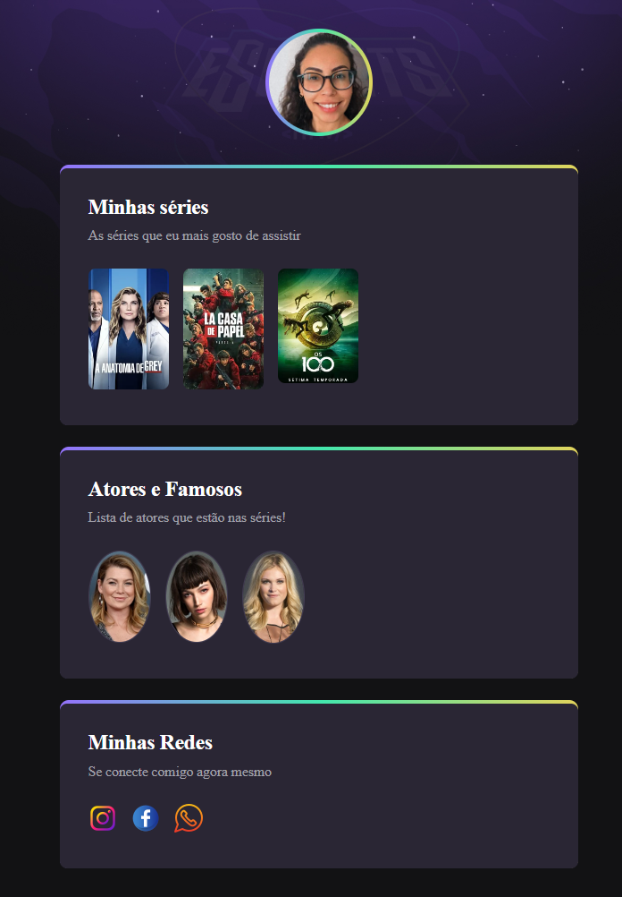

# NLW eSports 

> Trilha Explorer 

Projeto construído no evento Next Level Week (NLW) da Rocketseat.

[Clique aqui para acessar](https://rafaellydeoliveira.github.io/nlw-esports-explorer)

## Tecnologias 

- HTML
- CSS
- Git e GitHub

## O que aprendi

Participar da NLW eSports foi muito divertido, além de enriquecedor, diversos códigos novos e processos novos que aos poucos foram fazendo sentido conforme ja havia estudado no Discover (conteúdos gratuitos que a Rocketseat possui em seu site). 
Espero aprender muito mais ao final do Discover e ao longo da minha jornada de estudos em Programação. 
Esse foi só o primeiro projeto aqui no repositório do GitHub. de forma pública para que todos possam ver minha evolução.

## Contato

rafaelly2oliveira@hotmail.com